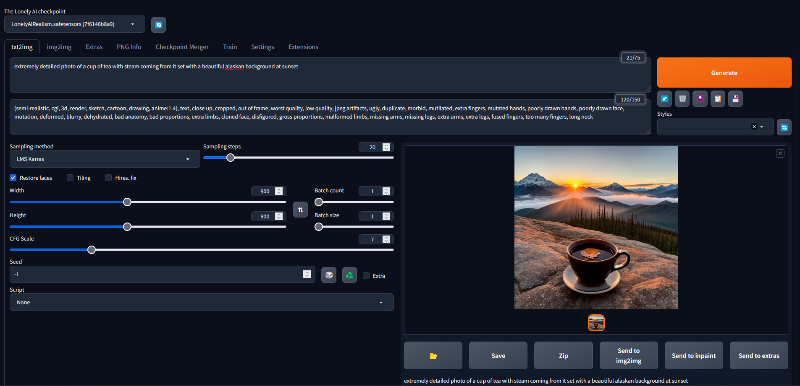

<!DOCTYPE html>
<html>
<head>
  <title>The Lonely AI Web UI</title>
  
</head>
<body>

  <h1>The Lonely AI Web UI</h1>

  

    Join our Discord: <a href="https://discord.gg/cWN3gyuZ" target="_blank">Connect Now</a>
  

  

    
  

  
Designed using Stable Diffusion, Midjourney, BrainAI, and ChatGPT.

  
The Lonely AI is an open-source image creator, similar to Stable Diffusion and Midjourney, but with a highly improved workflow and unlimited control.

  
The Lonely AI can be incorporated with AI (currently incorporated with BrainAI) to improve visual output and control.

  

    <strong>Update 6/24:</strong> Re-uploaded the whole file system with increased value ranges for specific outputs. Fixed width/height issues with GPU cores.
  

</body>
</html>
